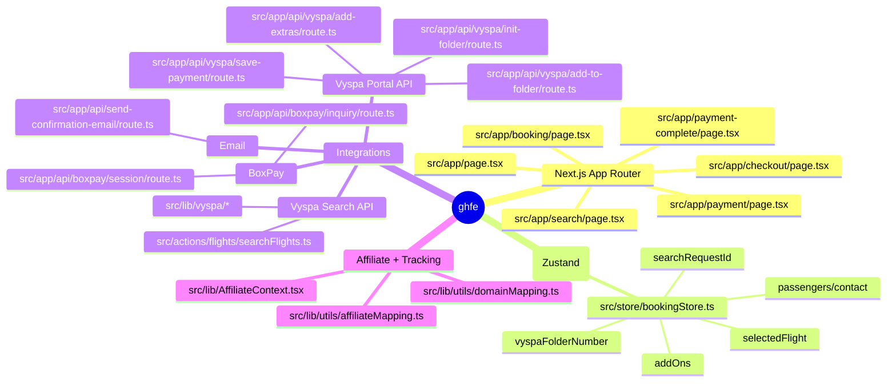

# Architecture Diagrams (Mermaid)

These diagrams are intentionally “high signal” and map directly to code entry points.

## System mindmap



## Container / module architecture

```mermaid
flowchart TB
  subgraph Browser[Browser (React)]
    Pages[src/app/** pages]
    Components[src/components/**]
    Hooks[src/hooks/**]
    Store[src/store/bookingStore.ts]
  end

  subgraph NextServer[Next.js Server (Node)]
    ServerActions[src/actions/**]
    ApiRoutes[src/app/api/**/route.ts]
    VyspaLib[src/lib/vyspa/**]
    Services[src/services/**]
    Config[src/config/**]
  end

  subgraph External[External Systems]
    VyspaSearch[Vyspa Search API]
    VyspaPortal[Vyspa Portal API]
    BoxPay[BoxPay]
    SMTP[SMTP / Email Provider]
  end

  Pages --> Hooks
  Components --> Hooks
  Hooks --> Store
  Hooks --> Services
  Services --> ServerActions
  Services --> ApiRoutes

  ServerActions --> VyspaLib
  VyspaLib --> VyspaSearch

  ApiRoutes --> VyspaSearch
  ApiRoutes --> VyspaPortal
  ApiRoutes --> BoxPay
  ApiRoutes --> SMTP

  Config --> ApiRoutes
  Config --> VyspaLib
```

## Core booking funnel (page transitions)

```mermaid
flowchart LR
  Home[/ (Landing)/] --> Search[/search/]
  Search --> Booking[/booking/]
  Booking --> Payment[/payment/]
  Payment --> BoxPayRedirect[[BoxPay Checkout Redirect]]
  BoxPayRedirect --> PaymentComplete[/payment-complete/]
```


