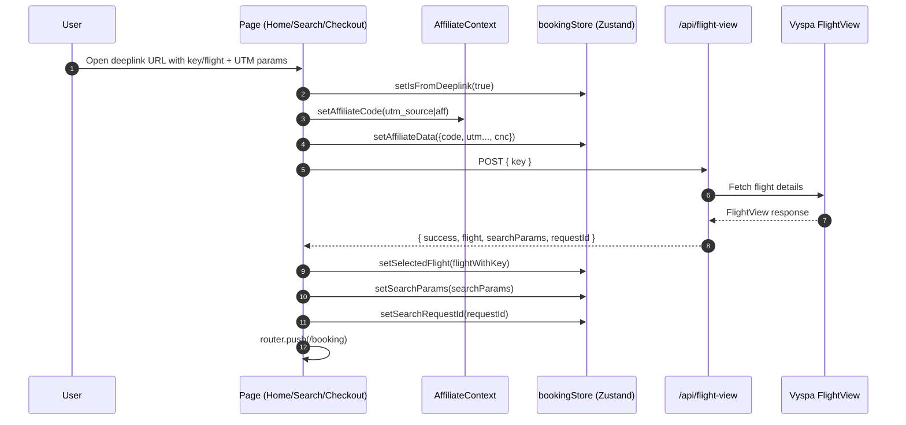

# Flow: Deeplinks (Meta channels / legacy URLs)

This repo supports deeplink entry points where the user arrives with a *pre-selected flight key*.

## Entry points

### 1) Landing page deeplink: `/?key=...`

Handled in:

- `src/app/page.tsx` (Home page effect reads `key`)

Behavior:

- If `key` is missing: show normal landing page.
- If `key` exists:
  - set `isFromDeeplink = true`
  - store tracking params (`utm_source`, `utm_medium`, `utm_campaign`, `cnc`) into:
    - `AffiliateContext` + Zustand `affiliateData`
    - `sessionStorage` (persistence across pages)
  - call `/api/flight-view` with `{ key }`
  - store returned `flight` + `searchParams` in Zustand
  - store returned `requestId` as `searchRequestId` (used as “web ref” until folder exists)
  - redirect to `/booking`

### 2) Search deeplink: `/search?flight=...`

Handled in:

- `src/app/search/page.tsx` (effect checks `flight` query param)

Behavior:

- Similar to landing deeplink: calls `/api/flight-view`, stores flight/search params, then redirects to `/booking`.

### 3) Legacy checkout URL: `/checkout.htm?flight=...`

Next.js rewrite:

- `next.config.ts` rewrites `/checkout.htm` → `/checkout`

Handled in:

- `src/app/checkout/page.tsx`

Behavior:

- Extract `flight` key + affiliate/tracking params
- Call `/api/flight-view`
- Store results in Zustand
- Redirect to `/booking`

## Deeplink sequence diagram (common path)

## API route used

- `POST /api/flight-view`: `src/app/api/flight-view/route.ts`

This route:

- uses Basic Auth from `VYSPA_CONFIG`
- calls the Vyspa FlightView endpoint (configurable via `VYSPA_FLIGHTVIEW_URL`)
- transforms the response via `transformFlightViewResponse` (see `src/services/api/flightViewService.ts`)

