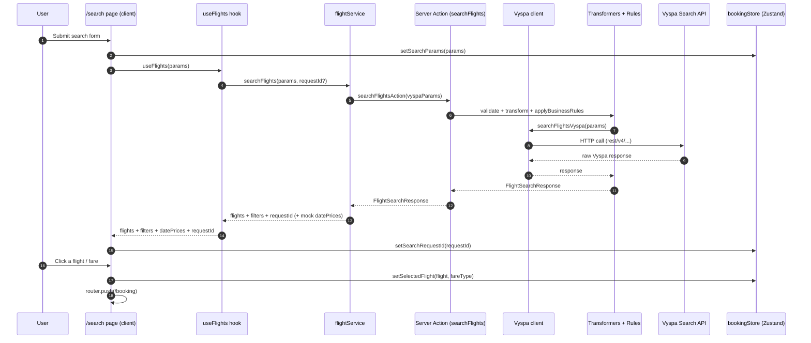

# Flow: Search → Results → Booking

This doc covers the *default* funnel where a user searches and then selects a flight.

## Responsibilities by layer

- **UI**: `src/app/search/page.tsx`
- **Flight fetching**: `src/hooks/useFlights.ts` → `src/services/api/flightService.ts`
- **Search execution**: server action `src/actions/flights/searchFlights.ts` → `src/lib/vyspa/*`
- **State handoff**: `src/store/bookingStore.ts` (`setSearchParams`, `setSelectedFlight`, `setSearchRequestId`)

## Sequence diagram

## Notes / important details

### Two “search” paths exist

- **Primary search** (used by `useFlights`): server action `src/actions/flights/searchFlights.ts`.
- **Batch search** (used for “date tile min price” or bulk min-price requests): API route `src/app/api/search-flights-batch/route.ts`.

They share the same underlying Vyspa transformation pipeline:

- `validateSearchParams`
- `searchFlightsVyspa`
- `transformVyspaResponse`
- `applyBusinessRules`

### Search session restoration (Request_id)

Vyspa supports a “restore session” style query via `Request_id`.

- The repo stores this as `searchRequestId` in Zustand (see `src/store/bookingStore.ts`).
- When present, the Vyspa client (`src/lib/vyspa/client.ts`) can submit a minimal payload that contains only `Request_id` + version fields.

